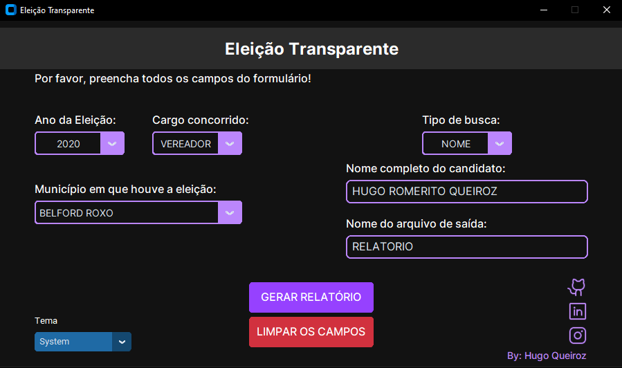
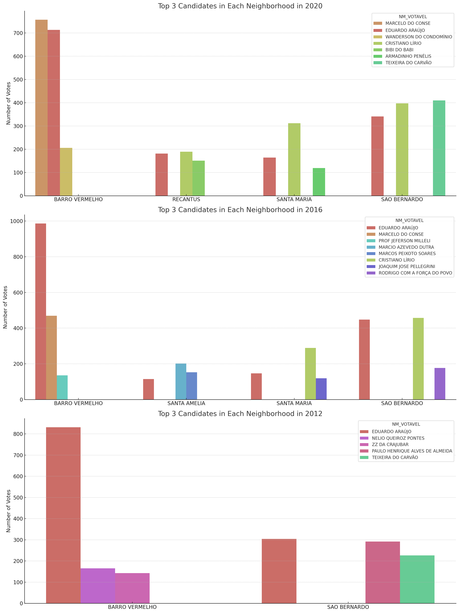
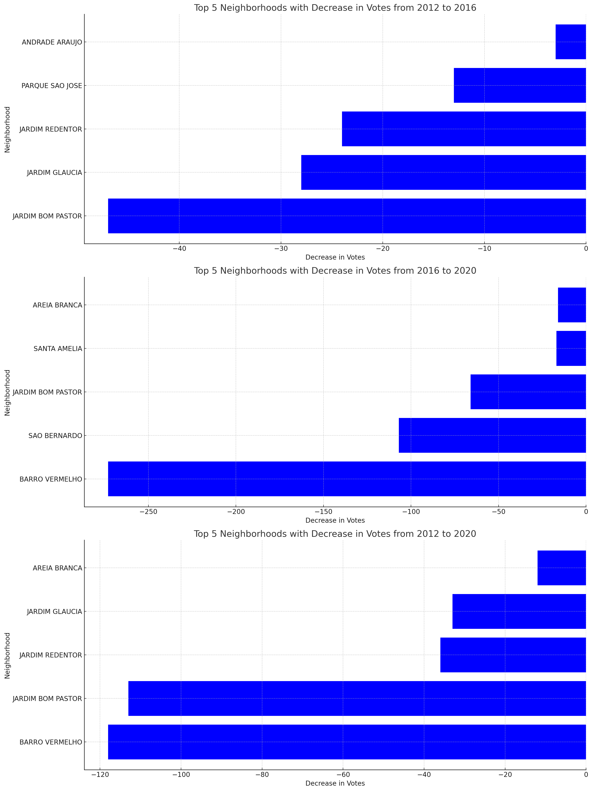
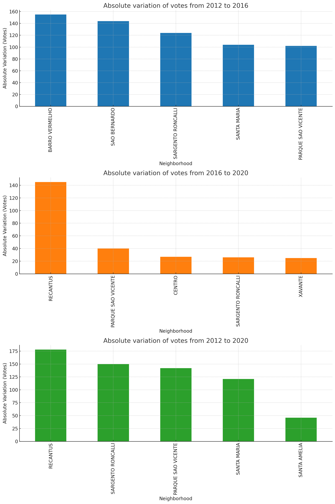
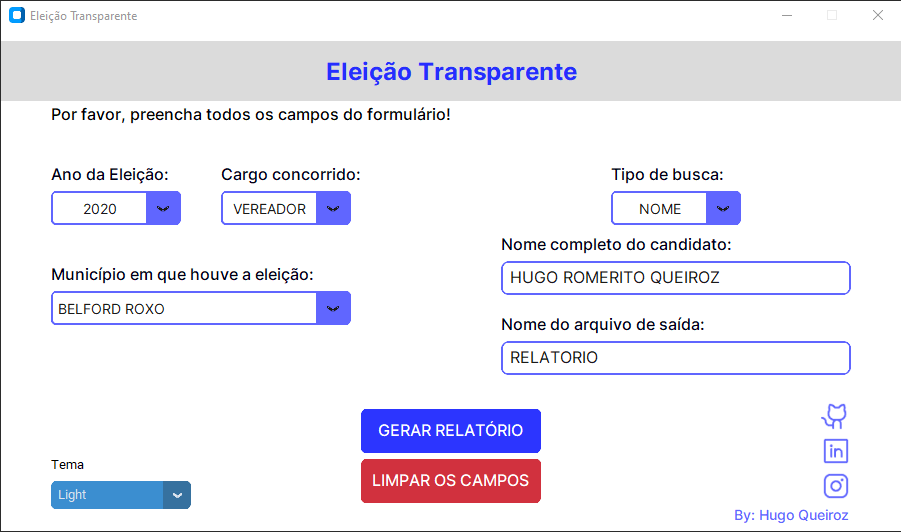

<div align="center">
  <h1>ELEIÇÃO TRANSPARENTE</h1>
  
</div>

[Veja aqui o Relatório produzido com os dados obtidos pelo Eleição Transparente](./documentation_images/relatorio_eleitoral.pdf)

## Contexto
A ideia deste projeto surgiu quando um vereador, para quem trabalho, me solicitou uma planilha dos votos recebidos por bairro na última eleição (2020). Embora eu tenha produzido essas informações manualmente após as eleições de 2020, os arquivos foram perdidos. Para evitar a repetição do trabalho manual e proporcionar uma solução mais sofisticada, decidi ir além do que me foi solicitado desenvolvendo essa aplicação.

Nesse processo, percebi que o desafio não era apenas criar uma planilha mais complexa, mas também lidar com a dificuldade de acessar informações públicas. As informações, embora disponíveis, eram de difícil acesso devido à sua organização por seção e zona, e à falta de uma interface intuitiva. Essa percepção me levou a uma compreensão mais profunda: o acesso à informação é um direito, mas muitas vezes é um desafio.

Assim, decidi transformar esse desafio em uma oportunidade. O projeto deixou de ser apenas uma solução para o meu problema e se tornou uma missão para tornar as informações mais acessíveis. Com o objetivo de criar uma plataforma intuitiva, onde qualquer pessoa possa acessar as informações necessárias sem esforço, decidi manter e expandir este projeto.

O software foi criado para ir além de simplesmente produzir uma planilha de votos por bairro. Ele também é capaz de destacar os três candidatos mais votados por bairro e gerar um gráfico baseado nessas informações. Além disso, incluí uma funcionalidade que permite comparar os dados de várias eleições. Assim, pude gerar um relatório detalhado com comparativos entre as eleições em termos de dados e gráficos, observando onde o candidato ganhou ou perdeu votos.

Através dessas análises, foi possível identificar a base eleitoral do candidato e os bairros com crescente apoio. Após a conclusão do relatório, criei uma interface gráfica para facilitar a busca de dados de outros candidatos sem necessidade de alterar o código-fonte. Esta interface é um reflexo do meu compromisso em tornar as informações públicas mais acessíveis e intuitivas para todos.

## Descrição
Desenvolvido em Python e com uso da biblioteca customtkinter, este programa é uma ferramenta para a análise e processamento de dados eleitorais. Sua interface intuitiva e eficiente permite que o usuário busque informações sobre candidatos de eleições específicas, utilizando como critério de busca o CPF ou Nome.

## Funcionalidades
1. Tipo de Busca: Escolha entre a busca por CPF ou Nome. A entrada será validada de acordo com o tipo de busca: somente letras para nome e somente números para CPF.
2. Nome: Digite o nome completo do candidato.
3. CPF: Digite o CPF do candidato.
4. Cidade: Selecione o município de onde deseja obter os dados.
5. Saída: Defina o nome do arquivo que será gerado com os resultados.
6. Cargo: Indique se o cargo em disputa é de "vereador" ou "prefeito".
7. Eleição: Especifique a eleição a partir da qual deseja coletar os dados.

O programa também conta com um botão para limpar todas as entradas e outro para dar início ao processamento dos dados.

## Processo
Uma vez preenchidos os campos e iniciado o processo, o programa irá buscar pelo candidato especificado. Uma janela subsequente exibirá uma lista de nomes usados pelo candidato nas eleições, permitindo ao usuário escolher qual deles será mantido no arquivo final. O nome escolhido será então refletido em todas as instâncias no arquivo.

O programa acessará e manipulará dois arquivos: um contendo a quantidade de votos do candidato por zona e seção e outro apresentando os colégios de cada bairro e cidade, com as seções correspondentes. A partir desses dados, será calculada a quantidade de votos do candidato por bairro.

Os resultados serão salvos como arquivos CSV na pasta "result", com o nome definido no campo "Saída", acompanhado de "_bairro". Além disso, será gerado um ranking dos três candidatos mais votados em cada bairro, conservando apenas os bairros onde o candidato analisado está entre os três primeiros. Este ranking também será salvo como arquivo CSV, com o sufixo "_ranking_bairro".

Finalmente, o programa cria um gráfico de barras, facilitando a visualização comparativa do desempenho do candidato em relação aos demais.

<div style="display: flex; flex-direction: column;">



</div>

## Modos de Visualização
O aplicativo possui três modos de visualização: Dark, Light e o modo Padrão do Sistema. O usuário pode escolher o que melhor se adapta às suas necessidades e preferências visuais.
<div style="display: flex; flex-direction: column;">


</div>

## Próximos Passos
Algumas funcionalidades, como a comparação entre eleições e a geração de gráficos de ganho e perda de votos entre eleições, ainda não estão disponíveis na versão atual do programa, pois ainda não foram adaptadas para a interface gráfica. No entanto, esses recursos estarão disponíveis em breve.

### Futuras Implementações
- Busca inserindo apenas o nome completo e então eliminar os campos de eleição, cargo e de município da janela principal, após ter inserido o nome ou cpf será apresentado uma janela com as eleições, cidades e com os cargos por qual o candidato concorreu, diminuindo as possibilidades de erro em busca da informação.
- Adicionar testes para as funções do programa.

## Como usar
1. Preencha todos os campos na interface do programa.
2. Clique no botão para iniciar o processamento dos dados.
3. Escolha o nome que deseja manter no arquivo final.
4. Clique em selecionar.
5. Verifique os arquivos resultantes gerados na pasta "result".

## Requisitos
Este projeto requer Python 3.7 ou superior. Além disso, ele depende das seguintes bibliotecas Python:

- re
- threading
- webbrowser
- tkinter
- PIL (Pillow)
- CTkMessagebox
- customtkinter
- pandas
- CTkListbox
- unidecode
- matplotlib

Você pode instalar essas dependências acessando o diretório do projeto e usando pip:
```
pip install -r requirements.txt
```

## Instalação
Para instalar o projeto, você pode clonar o repositório usando git:
```
git clone https://github.com/hugoromerito/eleicao_transparente.git
```

Em seguida instale as dependências necessárias usando o comando visto no tópico "Requisitos"
```
pip install -r requirements.txt
```

Para iniciar o programa, execute o arquivo main.py usando Python:
```
python main.py
```

## Diretrizes de Contribuição

Agradecemos seu interesse em contribuir para o nosso projeto! Queremos garantir que contribuir para este projeto seja fácil e transparente para todos. Aqui estão algumas diretrizes que esperamos que ajudem a tornar o processo mais eficiente e eficaz.

### Comunicação

1. **Problemas/Bugs**: Se você encontrou um bug no projeto, abra uma issue descrevendo o problema e adicione um label "bug".
2. **Solicitações de Recursos**: Se você gostaria de ver algum recurso ou melhoria no projeto, abra uma issue descrevendo sua ideia e adicione um label "feature request".

### Processo de Contribuição

1. **Fork do Repositório**: Faça um fork do repositório e clone-o para sua máquina local.
2. **Crie uma Nova Branch**: Crie uma branch com um nome descritivo para suas mudanças (por exemplo, `add-new-feature` ou `fix-bug`).
3. **Faça Suas Modificações**: Faça as modificações no código. Certifique-se de que o código está limpo e bem estruturado.
4. **Teste suas Modificações**: Verifique se suas modificações não quebram nada no projeto e se estão de acordo com os padrões de código.
5. **Commit das Mudanças**: Faça um commit de suas mudanças. Use uma mensagem de commit clara e significativa.
6. **Faça o Push de sua Branch**: Faça o push de sua branch para o seu fork no GitHub.
7. **Abra um Pull Request**: Volte para o repositório original e abra um Pull Request para a sua branch. Use a descrição do PR para explicar suas mudanças e planos. Se seu PR resolve uma issue, certifique-se de linká-la.

### Código de Conduta

Esperamos que todos os contribuintes respeitem os outros e se comportem profissionalmente. Qualquer forma de assédio, abuso, linguagem ofensiva ou desrespeito não será tolerada.

Estas são apenas diretrizes básicas e são um ponto de partida para você começar a contribuir para o projeto. Esperamos que você encontre sua experiência de contribuição gratificante e agradecemos antecipadamente por qualquer ajuda que você possa oferecer a este projeto.

## Licença
Este projeto está licenciado sob a Licença MIT.
